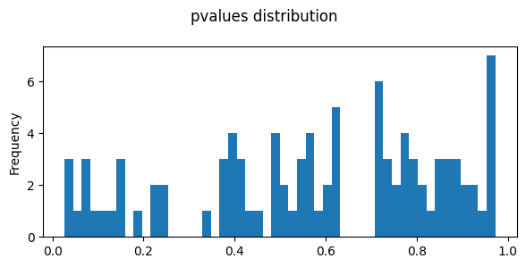
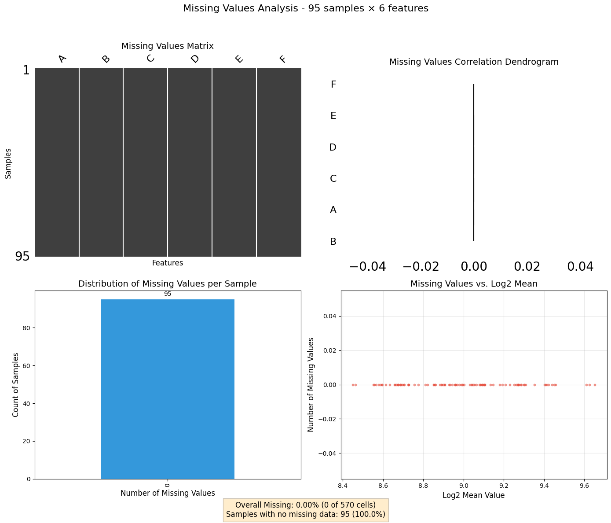

<!-- WARNING: THIS FILE WAS AUTOGENERATED! DO NOT EDIT! -->

``` python
#reload when modified


#activate r magic
```

``` python
import pandas as pd
from IPython.display import Image, display
import os
import re
import tqdm
```

``` python
import svist4get as sv4g
```

``` python
import os
import pandas as pd
import numpy as np
import matplotlib.pyplot as plt
import seaborn as sns
#import utilities as UT
import missingno as msno
import random
import matplotlib.pyplot as plt
import matplotlib.patches as patches
import gc
from io import StringIO
from itertools import islice
from Bio import SeqIO

random.seed(1976)
np.random.seed(1976)
```

``` python
import multiprocessing
multiprocessing.cpu_count()
```

    4

``` python
import pandas as pd
import numpy as np

# Set random seed for reproducibility
np.random.seed(42)
# Create a DataFrame with 6 columns and 100 rows of random values
df = pd.DataFrame({
    'A': np.random.randint(0, 1000, size=100),
    'B': np.random.randint(0, 1000, size=100),
    'C': np.random.randint(0, 1000, size=100),
    'D': np.random.randint(0, 1000, size=100),
    'E': np.random.randint(0, 1000, size=100),
    'F': np.random.randint(0, 1000, size=100),
})

# Display the first few rows
print(df.shape)
df.head()
```

    (100, 6)

<div>
<style scoped>
    .dataframe tbody tr th:only-of-type {
        vertical-align: middle;
    }
&#10;    .dataframe tbody tr th {
        vertical-align: top;
    }
&#10;    .dataframe thead th {
        text-align: right;
    }
</style>

<table class="dataframe" data-quarto-postprocess="true" data-border="1">
<thead>
<tr style="text-align: right;">
<th data-quarto-table-cell-role="th"></th>
<th data-quarto-table-cell-role="th">A</th>
<th data-quarto-table-cell-role="th">B</th>
<th data-quarto-table-cell-role="th">C</th>
<th data-quarto-table-cell-role="th">D</th>
<th data-quarto-table-cell-role="th">E</th>
<th data-quarto-table-cell-role="th">F</th>
</tr>
</thead>
<tbody>
<tr>
<td data-quarto-table-cell-role="th">0</td>
<td>102</td>
<td>555</td>
<td>899</td>
<td>709</td>
<td>472</td>
<td>322</td>
</tr>
<tr>
<td data-quarto-table-cell-role="th">1</td>
<td>435</td>
<td>161</td>
<td>733</td>
<td>415</td>
<td>98</td>
<td>871</td>
</tr>
<tr>
<td data-quarto-table-cell-role="th">2</td>
<td>860</td>
<td>201</td>
<td>484</td>
<td>246</td>
<td>152</td>
<td>685</td>
</tr>
<tr>
<td data-quarto-table-cell-role="th">3</td>
<td>270</td>
<td>957</td>
<td>406</td>
<td>835</td>
<td>860</td>
<td>791</td>
</tr>
<tr>
<td data-quarto-table-cell-role="th">4</td>
<td>106</td>
<td>995</td>
<td>230</td>
<td>438</td>
<td>913</td>
<td>625</td>
</tr>
</tbody>
</table>

</div>

``` python
options(warn=-1)
library("limma") 
library("edgeR")
library("cqn")
library("scales")
head(df)
```

        A   B   C   D   E   F
    0 102 555 899 709 472 322
    1 435 161 733 415  98 871
    2 860 201 484 246 152 685
    3 270 957 406 835 860 791
    4 106 995 230 438 913 625
    5  71 269 748 202 895 287

    Loading required package: mclust
                       __           __ 
       ____ ___  _____/ /_  _______/ /_
      / __ `__ \/ ___/ / / / / ___/ __/
     / / / / / / /__/ / /_/ (__  ) /_  
    /_/ /_/ /_/\___/_/\__,_/____/\__/   version 6.1.1
    Type 'citation("mclust")' for citing this R package in publications.

    Attaching package: ‘mclust’

    The following object is masked from ‘package:limma’:

        logsumexp

    In addition: Warning message:
    In (function (package, help, pos = 2, lib.loc = NULL, character.only = FALSE,  :
      library ‘/usr/lib/R/site-library’ contains no packages

``` python
group <- factor(c(
    'A','A','A','B','B','B'
))

y <- DGEList(counts=df, group=group)
keep <- filterByExpr(y, min.count = 100, min.total.count = 2000)
y <- y[keep,,keep.lib.sizes=FALSE]
counts = y$counts
genes = row.names(y)
```

``` python
indata = pd.DataFrame(counts, index=genes,columns=df.columns)
indata.shape
```

    (95, 6)

``` python
#https://rstudio-pubs-static.s3.amazonaws.com/79395_b07ae39ce8124a5c873bd46d6075c137.html
library(edgeR)
# Make groups
design_with_all <- model.matrix( ~0+group )

y <- DGEList(counts=indata, 
                  group = group, 
                  )
# Estimate dispersion
y <- estimateGLMCommonDisp( y, design_with_all )
y <- estimateGLMTrendedDisp( y, design_with_all )
y <- estimateGLMTagwiseDisp( y, design_with_all )
# Fit counts to model
fit_all <- glmQLFit( y, design_with_all )
```

``` python
contrast <- glmQLFTest(fit_all, contrast=makeContrasts( groupA-groupB, levels=design_with_all ) )
table <- topTags(contrast, n=Inf, sort.by = "none", adjust.method="BH")$table
head(table)
```

            logFC   logCPM           F    PValue       FDR
    0  0.06597355 13.34298 0.005686085 0.9406702 0.9719433
    1  0.04059561 13.14642 0.001846354 0.9661689 0.9719433
    2  0.63753291 13.12779 0.474061532 0.4993443 0.9719433
    3 -0.55140493 13.77109 0.744456113 0.3988653 0.9719433
    4 -0.51947133 13.45730 0.360391428 0.5552954 0.9719433
    5 -0.34710021 13.03854 0.119907431 0.7328934 0.9719433

``` python
fig,axes=plt.subplots(ncols=1,nrows=1,figsize=(6,3))
table.PValue.plot(kind='hist',bins=50,ax=axes)
plt.suptitle('pvalues distribution')
plt.tight_layout()
plt.show()
```



``` python
from ProjectUtility.mis_val_utility import *
mv_analyzer = MissingValuesAnalyzer(indata)
# Generate the dashboard
fig, axes, summary = mv_analyzer.plot_missing_dashboard()
```


