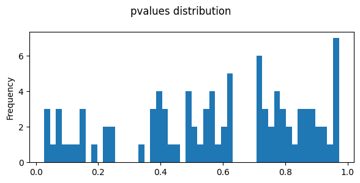

# Testing R-Python Integration


<!-- WARNING: THIS FILE WAS AUTOGENERATED! DO NOT EDIT! -->

``` python
#reload when modified
```

``` python
import pandas as pd
from IPython.display import Image, display
import os
import re
import tqdm
```

``` python
import svist4get as sv4g
```

``` python
import os
import pandas as pd
import numpy as np
import matplotlib.pyplot as plt
import seaborn as sns
#import utilities as UT
import missingno as msno
import random
import matplotlib.pyplot as plt
import matplotlib.patches as patches
import gc
from io import StringIO
from itertools import islice
from Bio import SeqIO

random.seed(1976)
np.random.seed(1976)
```

``` python
import multiprocessing
multiprocessing.cpu_count()
```

    12

``` python
import pandas as pd
import numpy as np

# Set random seed for reproducibility
np.random.seed(42)
# Create a DataFrame with 6 columns and 100 rows of random values
df = pd.DataFrame({
    'A': np.random.randint(0, 1000, size=100),
    'B': np.random.randint(0, 1000, size=100),
    'C': np.random.randint(0, 1000, size=100),
    'D': np.random.randint(0, 1000, size=100),
    'E': np.random.randint(0, 1000, size=100),
    'F': np.random.randint(0, 1000, size=100),
})

# Display the first few rows
print(df.shape)
df.head()
```

    (100, 6)

<div>
<style scoped>
    .dataframe tbody tr th:only-of-type {
        vertical-align: middle;
    }
&#10;    .dataframe tbody tr th {
        vertical-align: top;
    }
&#10;    .dataframe thead th {
        text-align: right;
    }
</style>

<table class="dataframe" data-quarto-postprocess="true" data-border="1">
<thead>
<tr style="text-align: right;">
<th data-quarto-table-cell-role="th"></th>
<th data-quarto-table-cell-role="th">A</th>
<th data-quarto-table-cell-role="th">B</th>
<th data-quarto-table-cell-role="th">C</th>
<th data-quarto-table-cell-role="th">D</th>
<th data-quarto-table-cell-role="th">E</th>
<th data-quarto-table-cell-role="th">F</th>
</tr>
</thead>
<tbody>
<tr>
<td data-quarto-table-cell-role="th">0</td>
<td>102</td>
<td>555</td>
<td>899</td>
<td>709</td>
<td>472</td>
<td>322</td>
</tr>
<tr>
<td data-quarto-table-cell-role="th">1</td>
<td>435</td>
<td>161</td>
<td>733</td>
<td>415</td>
<td>98</td>
<td>871</td>
</tr>
<tr>
<td data-quarto-table-cell-role="th">2</td>
<td>860</td>
<td>201</td>
<td>484</td>
<td>246</td>
<td>152</td>
<td>685</td>
</tr>
<tr>
<td data-quarto-table-cell-role="th">3</td>
<td>270</td>
<td>957</td>
<td>406</td>
<td>835</td>
<td>860</td>
<td>791</td>
</tr>
<tr>
<td data-quarto-table-cell-role="th">4</td>
<td>106</td>
<td>995</td>
<td>230</td>
<td>438</td>
<td>913</td>
<td>625</td>
</tr>
</tbody>
</table>

</div>

``` python
options(warn=-1)
library("limma") 
library("edgeR")
library("cqn")
library("scales")
head(df)
```

        A   B   C   D   E   F
    0 102 555 899 709 472 322
    1 435 161 733 415  98 871
    2 860 201 484 246 152 685
    3 270 957 406 835 860 791
    4 106 995 230 438 913 625
    5  71 269 748 202 895 287

``` python
group <- factor(c(
    'A','A','A','B','B','B'
))

y <- DGEList(counts=df, group=group)
keep <- filterByExpr(y, min.count = 100, min.total.count = 2000)
y <- y[keep,,keep.lib.sizes=FALSE]
counts = y$counts
genes = row.names(y)
```

``` python
indata = pd.DataFrame(counts, index=genes,columns=df.columns)
indata.shape
```

    (95, 6)

``` python
#https://rstudio-pubs-static.s3.amazonaws.com/79395_b07ae39ce8124a5c873bd46d6075c137.html
library(edgeR)
# Make groups
design_with_all <- model.matrix( ~0+group )

y <- DGEList(counts=indata, 
                  group = group, 
                  )
# Estimate dispersion
y <- estimateGLMCommonDisp( y, design_with_all )
y <- estimateGLMTrendedDisp( y, design_with_all )
y <- estimateGLMTagwiseDisp( y, design_with_all )
# Fit counts to model
fit_all <- glmQLFit( y, design_with_all )
```

``` python
contrast <- glmQLFTest(fit_all, contrast=makeContrasts( groupA-groupB, levels=design_with_all ) )
table <- topTags(contrast, n=Inf, sort.by = "none", adjust.method="BH")$table
head(table)
```

            logFC   logCPM           F    PValue       FDR
    0  0.06557184 13.34298 0.005041796 0.9443735 0.9720116
    1  0.04093098 13.14642 0.001779103 0.9669370 0.9720116
    2  0.63822136 13.12779 0.463060552 0.5070295 0.9720116
    3 -0.55146249 13.77109 0.776125452 0.3928463 0.9720116
    4 -0.51958511 13.45730 0.310887813 0.5857299 0.9720116
    5 -0.34783483 13.03854 0.114259640 0.7402404 0.9720116

``` python
fig,axes=plt.subplots(ncols=1,nrows=1,figsize=(6,3))
table.PValue.plot(kind='hist',bins=50,ax=axes)
plt.suptitle('pvalues distribution')
plt.tight_layout()
plt.show()
```



``` python
import panel as pn
import holoviews as hv
import numpy as np

# Initialize panel and holoviews
pn.extension()
hv.extension('bokeh')

# Generate some data
x = np.arange(10)
y = np.random.rand(10)

# Create a scatter plot
scatter = hv.Scatter((x, y)).opts(
    width=400, height=300, 
    tools=['hover', 'tap'],
    size=10, 
    color='blue',
    title='Click on points to see data'
)

# Create a tap stream connected to our scatter plot
tap = hv.streams.Tap(source=scatter)

# Create a DynamicMap that updates with tap events
def tap_info(x, y):
    if x is None or y is None:
        return hv.Div('Click on a point')
    return hv.Div(f'Clicked point at x={x:.2f}, y={y:.4f}')

tap_display = hv.DynamicMap(tap_info, streams=[tap])

# Create layout and serve
layout = pn.Column(
    pn.pane.HoloViews(scatter),
    pn.pane.HoloViews(tap_display)
)

# Serve the application
layout.servable()
```

<script type="esms-options">{"shimMode": true}</script><style>*[data-root-id],
*[data-root-id] > * {
  box-sizing: border-box;
  font-family: var(--jp-ui-font-family);
  font-size: var(--jp-ui-font-size1);
  color: var(--vscode-editor-foreground, var(--jp-ui-font-color1));
}
&#10;/* Override VSCode background color */
.cell-output-ipywidget-background:has(
    > .cell-output-ipywidget-background > .lm-Widget > *[data-root-id]
  ),
.cell-output-ipywidget-background:has(> .lm-Widget > *[data-root-id]) {
  background-color: transparent !important;
}
</style>

    Unable to display output for mime type(s): application/javascript, application/vnd.holoviews_load.v0+json

    Unable to display output for mime type(s): application/javascript, application/vnd.holoviews_load.v0+json

<script type="esms-options">{"shimMode": true}</script><style>*[data-root-id],
*[data-root-id] > * {
  box-sizing: border-box;
  font-family: var(--jp-ui-font-family);
  font-size: var(--jp-ui-font-size1);
  color: var(--vscode-editor-foreground, var(--jp-ui-font-color1));
}
&#10;/* Override VSCode background color */
.cell-output-ipywidget-background:has(
    > .cell-output-ipywidget-background > .lm-Widget > *[data-root-id]
  ),
.cell-output-ipywidget-background:has(> .lm-Widget > *[data-root-id]) {
  background-color: transparent !important;
}
</style>

    Unable to display output for mime type(s): application/javascript, application/vnd.holoviews_load.v0+json

    Unable to display output for mime type(s): application/javascript, application/vnd.holoviews_load.v0+json

<div id='6e5842b1-e20c-4755-8ef9-e1d7bf25c9ef'>
  <div id="d73697cb-7318-4c58-b37e-5d9d2caad5bd" data-root-id="6e5842b1-e20c-4755-8ef9-e1d7bf25c9ef" style="display: contents;"></div>
</div>
<script type="application/javascript">(function(root) {
  var docs_json = {"87222e1f-c8bc-470a-b7a3-7bf4edc802eb":{"version":"3.7.2","title":"Bokeh Application","roots":[{"type":"object","name":"panel.models.browser.BrowserInfo","id":"6e5842b1-e20c-4755-8ef9-e1d7bf25c9ef"},{"type":"object","name":"panel.models.comm_manager.CommManager","id":"8645e3f3-66ee-4ee3-a18f-f82afe25e792","attributes":{"plot_id":"6e5842b1-e20c-4755-8ef9-e1d7bf25c9ef","comm_id":"9140f8a9910747989ae9cb692cf8d3a8","client_comm_id":"89a015aca37b4c56951fdb85d7c0a6ff"}}],"defs":[{"type":"model","name":"ReactiveHTML1"},{"type":"model","name":"FlexBox1","properties":[{"name":"align_content","kind":"Any","default":"flex-start"},{"name":"align_items","kind":"Any","default":"flex-start"},{"name":"flex_direction","kind":"Any","default":"row"},{"name":"flex_wrap","kind":"Any","default":"wrap"},{"name":"gap","kind":"Any","default":""},{"name":"justify_content","kind":"Any","default":"flex-start"}]},{"type":"model","name":"FloatPanel1","properties":[{"name":"config","kind":"Any","default":{"type":"map"}},{"name":"contained","kind":"Any","default":true},{"name":"position","kind":"Any","default":"right-top"},{"name":"offsetx","kind":"Any","default":null},{"name":"offsety","kind":"Any","default":null},{"name":"theme","kind":"Any","default":"primary"},{"name":"status","kind":"Any","default":"normalized"}]},{"type":"model","name":"GridStack1","properties":[{"name":"ncols","kind":"Any","default":null},{"name":"nrows","kind":"Any","default":null},{"name":"allow_resize","kind":"Any","default":true},{"name":"allow_drag","kind":"Any","default":true},{"name":"state","kind":"Any","default":[]}]},{"type":"model","name":"drag1","properties":[{"name":"slider_width","kind":"Any","default":5},{"name":"slider_color","kind":"Any","default":"black"},{"name":"value","kind":"Any","default":50}]},{"type":"model","name":"click1","properties":[{"name":"terminal_output","kind":"Any","default":""},{"name":"debug_name","kind":"Any","default":""},{"name":"clears","kind":"Any","default":0}]},{"type":"model","name":"FastWrapper1","properties":[{"name":"object","kind":"Any","default":null},{"name":"style","kind":"Any","default":null}]},{"type":"model","name":"NotificationArea1","properties":[{"name":"js_events","kind":"Any","default":{"type":"map"}},{"name":"max_notifications","kind":"Any","default":5},{"name":"notifications","kind":"Any","default":[]},{"name":"position","kind":"Any","default":"bottom-right"},{"name":"_clear","kind":"Any","default":0},{"name":"types","kind":"Any","default":[{"type":"map","entries":[["type","warning"],["background","#ffc107"],["icon",{"type":"map","entries":[["className","fas fa-exclamation-triangle"],["tagName","i"],["color","white"]]}]]},{"type":"map","entries":[["type","info"],["background","#007bff"],["icon",{"type":"map","entries":[["className","fas fa-info-circle"],["tagName","i"],["color","white"]]}]]}]}]},{"type":"model","name":"Notification","properties":[{"name":"background","kind":"Any","default":null},{"name":"duration","kind":"Any","default":3000},{"name":"icon","kind":"Any","default":null},{"name":"message","kind":"Any","default":""},{"name":"notification_type","kind":"Any","default":null},{"name":"_rendered","kind":"Any","default":false},{"name":"_destroyed","kind":"Any","default":false}]},{"type":"model","name":"TemplateActions1","properties":[{"name":"open_modal","kind":"Any","default":0},{"name":"close_modal","kind":"Any","default":0}]},{"type":"model","name":"BootstrapTemplateActions1","properties":[{"name":"open_modal","kind":"Any","default":0},{"name":"close_modal","kind":"Any","default":0}]},{"type":"model","name":"TemplateEditor1","properties":[{"name":"layout","kind":"Any","default":[]}]},{"type":"model","name":"MaterialTemplateActions1","properties":[{"name":"open_modal","kind":"Any","default":0},{"name":"close_modal","kind":"Any","default":0}]},{"type":"model","name":"ReactiveESM1","properties":[{"name":"esm_constants","kind":"Any","default":{"type":"map"}}]},{"type":"model","name":"JSComponent1","properties":[{"name":"esm_constants","kind":"Any","default":{"type":"map"}}]},{"type":"model","name":"ReactComponent1","properties":[{"name":"esm_constants","kind":"Any","default":{"type":"map"}}]},{"type":"model","name":"AnyWidgetComponent1","properties":[{"name":"esm_constants","kind":"Any","default":{"type":"map"}}]},{"type":"model","name":"request_value1","properties":[{"name":"fill","kind":"Any","default":"none"},{"name":"_synced","kind":"Any","default":null},{"name":"_request_sync","kind":"Any","default":0}]}]}};
  var render_items = [{"docid":"87222e1f-c8bc-470a-b7a3-7bf4edc802eb","roots":{"6e5842b1-e20c-4755-8ef9-e1d7bf25c9ef":"d73697cb-7318-4c58-b37e-5d9d2caad5bd"},"root_ids":["6e5842b1-e20c-4755-8ef9-e1d7bf25c9ef"]}];
  var docs = Object.values(docs_json)
  if (!docs) {
    return
  }
  const py_version = docs[0].version.replace('rc', '-rc.').replace('.dev', '-dev.')
  async function embed_document(root) {
    var Bokeh = get_bokeh(root)
    await Bokeh.embed.embed_items_notebook(docs_json, render_items);
    for (const render_item of render_items) {
      for (const root_id of render_item.root_ids) {
    const id_el = document.getElementById(root_id)
    if (id_el.children.length && id_el.children[0].hasAttribute('data-root-id')) {
      const root_el = id_el.children[0]
      root_el.id = root_el.id + '-rendered'
      for (const child of root_el.children) {
            // Ensure JupyterLab does not capture keyboard shortcuts
            // see: https://jupyterlab.readthedocs.io/en/4.1.x/extension/notebook.html#keyboard-interaction-model
        child.setAttribute('data-lm-suppress-shortcuts', 'true')
      }
    }
      }
    }
  }
  function get_bokeh(root) {
    if (root.Bokeh === undefined) {
      return null
    } else if (root.Bokeh.version !== py_version) {
      if (root.Bokeh.versions === undefined || !root.Bokeh.versions.has(py_version)) {
    return null
      }
      return root.Bokeh.versions.get(py_version);
    } else if (root.Bokeh.version === py_version) {
      return root.Bokeh
    }
    return null
  }
  function is_loaded(root) {
    var Bokeh = get_bokeh(root)
    return (Bokeh != null && Bokeh.Panel !== undefined)
  }
  if (is_loaded(root)) {
    embed_document(root);
  } else {
    var attempts = 0;
    var timer = setInterval(function(root) {
      if (is_loaded(root)) {
        clearInterval(timer);
        embed_document(root);
      } else if (document.readyState == "complete") {
        attempts++;
        if (attempts > 200) {
          clearInterval(timer);
      var Bokeh = get_bokeh(root)
      if (Bokeh == null || Bokeh.Panel == null) {
            console.warn("Panel: ERROR: Unable to run Panel code because Bokeh or Panel library is missing");
      } else {
        console.warn("Panel: WARNING: Attempting to render but not all required libraries could be resolved.")
        embed_document(root)
      }
        }
      }
    }, 25, root)
  }
})(window);</script>

<script type="esms-options">{"shimMode": true}</script><style>*[data-root-id],
*[data-root-id] > * {
  box-sizing: border-box;
  font-family: var(--jp-ui-font-family);
  font-size: var(--jp-ui-font-size1);
  color: var(--vscode-editor-foreground, var(--jp-ui-font-color1));
}
&#10;/* Override VSCode background color */
.cell-output-ipywidget-background:has(
    > .cell-output-ipywidget-background > .lm-Widget > *[data-root-id]
  ),
.cell-output-ipywidget-background:has(> .lm-Widget > *[data-root-id]) {
  background-color: transparent !important;
}
</style>

    Unable to display output for mime type(s): application/javascript, application/vnd.holoviews_load.v0+json

    Unable to display output for mime type(s): application/javascript, application/vnd.holoviews_load.v0+json

<div id='47d65fda-6dd1-430c-a9cd-11dadaf3bb62'>
  <div id="ef1eac23-ce61-45cf-85f7-ba2d2b807566" data-root-id="47d65fda-6dd1-430c-a9cd-11dadaf3bb62" style="display: contents;"></div>
</div>
<script type="application/javascript">(function(root) {
  var docs_json = {"b052d3c1-2a01-4d02-bfa6-cf8381a8d377":{"version":"3.7.2","title":"Bokeh Application","roots":[{"type":"object","name":"panel.models.layout.Column","id":"47d65fda-6dd1-430c-a9cd-11dadaf3bb62","attributes":{"name":"Column00276","stylesheets":["\n:host(.pn-loading):before, .pn-loading:before {\n  background-color: #c3c3c3;\n  mask-size: auto calc(min(50%, 400px));\n  -webkit-mask-size: auto calc(min(50%, 400px));\n}",{"type":"object","name":"ImportedStyleSheet","id":"3dfb36f2-2412-498b-ad48-b70001d1b9df","attributes":{"url":"https://cdn.holoviz.org/panel/1.6.2/dist/css/loading.css"}},{"type":"object","name":"ImportedStyleSheet","id":"462b818c-c402-4b97-bb1e-750ebda62ba1","attributes":{"url":"https://cdn.holoviz.org/panel/1.6.2/dist/css/listpanel.css"}},{"type":"object","name":"ImportedStyleSheet","id":"5d075994-f548-4415-8be1-43f81445f092","attributes":{"url":"https://cdn.holoviz.org/panel/1.6.2/dist/bundled/theme/default.css"}},{"type":"object","name":"ImportedStyleSheet","id":"f33f5b1f-c437-4c26-b159-94a2e6a069c8","attributes":{"url":"https://cdn.holoviz.org/panel/1.6.2/dist/bundled/theme/native.css"}}],"margin":0,"align":"start","children":[{"type":"object","name":"Figure","id":"4458fe76-f499-47d7-99cd-e9e0e23d6402","attributes":{"subscribed_events":{"type":"set","entries":["tap","doubletap"]},"width":400,"height":300,"margin":[5,10],"sizing_mode":"fixed","align":"start","x_range":{"type":"object","name":"Range1d","id":"5b1f882f-7106-4ceb-a57f-9e1ede4ff20e","attributes":{"name":"x","tags":[[["x",null]],[]],"start":-0.675,"end":9.675,"reset_start":-0.675,"reset_end":9.675}},"y_range":{"type":"object","name":"Range1d","id":"1402a4f4-6741-4a53-873d-c0269a75376a","attributes":{"name":"y","tags":[[["y",null]],{"type":"map","entries":[["invert_yaxis",false],["autorange",false]]}],"start":-0.06837902371078924,"end":1.0563781818041718,"reset_start":-0.06837902371078924,"reset_end":1.0563781818041718}},"x_scale":{"type":"object","name":"LinearScale","id":"f78f5f3a-06bd-468b-aa29-448389855253"},"y_scale":{"type":"object","name":"LinearScale","id":"87859c9c-5f1b-442b-9af1-c48a4a2c38fb"},"title":{"type":"object","name":"Title","id":"5be35e54-f45c-45a6-9c9b-60691d813483","attributes":{"text":"Click on points to see data","text_color":"black","text_font_size":"12pt"}},"renderers":[{"type":"object","name":"GlyphRenderer","id":"39402725-ca79-48e5-8f52-35ab4e914a91","attributes":{"data_source":{"type":"object","name":"ColumnDataSource","id":"5327d95b-7314-43eb-b874-fc16976c5dff","attributes":{"selected":{"type":"object","name":"Selection","id":"2f5b406e-d786-4f98-b56e-60b452d14b7d","attributes":{"indices":[],"line_indices":[]}},"selection_policy":{"type":"object","name":"UnionRenderers","id":"a49624cf-94a8-4bbd-91dd-dca108307283"},"data":{"type":"map","entries":[["x",{"type":"ndarray","array":{"type":"bytes","data":"AAAAAAEAAAACAAAAAwAAAAQAAAAFAAAABgAAAAcAAAAIAAAACQAAAA=="},"shape":[10],"dtype":"int32","order":"little"}],["y",{"type":"ndarray","array":{"type":"bytes","data":"uNl3y1BV0T+gzPOVGxjcP6gMB6i3FbQ/4D6Yl4v1mT9c0FIMBM7uPxGYtmFZwOo/HgbBsmtF5j80Lnf4SCzaPyS3pB6CLsY/7N8TByEGxD8="},"shape":[10],"dtype":"float64","order":"little"}]]}}},"view":{"type":"object","name":"CDSView","id":"ab238103-e92c-4bf1-a581-3eaa98d2fcc6","attributes":{"filter":{"type":"object","name":"AllIndices","id":"a7edee30-2495-479d-9fdb-cd6e277df849"}}},"glyph":{"type":"object","name":"Scatter","id":"4576cbcb-f222-4b73-b22c-57245f2c823d","attributes":{"tags":["apply_ranges"],"x":{"type":"field","field":"x"},"y":{"type":"field","field":"y"},"size":{"type":"value","value":10},"line_color":{"type":"value","value":"blue"},"fill_color":{"type":"value","value":"blue"},"hatch_color":{"type":"value","value":"blue"}}},"selection_glyph":{"type":"object","name":"Scatter","id":"4026485b-8144-4fe5-8cbd-4a93547ee933","attributes":{"tags":["apply_ranges"],"x":{"type":"field","field":"x"},"y":{"type":"field","field":"y"},"size":{"type":"value","value":10},"angle":{"type":"value","value":0.0},"line_color":{"type":"value","value":"blue"},"line_alpha":{"type":"value","value":1.0},"line_width":{"type":"value","value":1},"line_join":{"type":"value","value":"bevel"},"line_cap":{"type":"value","value":"butt"},"line_dash":{"type":"value","value":[]},"line_dash_offset":{"type":"value","value":0},"fill_color":{"type":"value","value":"blue"},"fill_alpha":{"type":"value","value":1.0},"hatch_color":{"type":"value","value":"blue"},"hatch_alpha":{"type":"value","value":1.0},"hatch_scale":{"type":"value","value":12.0},"hatch_pattern":{"type":"value","value":null},"hatch_weight":{"type":"value","value":1.0},"marker":{"type":"value","value":"circle"}}},"nonselection_glyph":{"type":"object","name":"Scatter","id":"eb785a0f-6a8b-489e-862f-12a99dc43225","attributes":{"tags":["apply_ranges"],"x":{"type":"field","field":"x"},"y":{"type":"field","field":"y"},"size":{"type":"value","value":10},"line_color":{"type":"value","value":"blue"},"line_alpha":{"type":"value","value":0.1},"fill_color":{"type":"value","value":"blue"},"fill_alpha":{"type":"value","value":0.1},"hatch_color":{"type":"value","value":"blue"},"hatch_alpha":{"type":"value","value":0.1}}},"muted_glyph":{"type":"object","name":"Scatter","id":"dcbe0cbe-2284-47ff-a714-458fffa9cc16","attributes":{"tags":["apply_ranges"],"x":{"type":"field","field":"x"},"y":{"type":"field","field":"y"},"size":{"type":"value","value":10},"line_color":{"type":"value","value":"blue"},"line_alpha":{"type":"value","value":0.2},"fill_color":{"type":"value","value":"blue"},"fill_alpha":{"type":"value","value":0.2},"hatch_color":{"type":"value","value":"blue"},"hatch_alpha":{"type":"value","value":0.2}}}}}],"toolbar":{"type":"object","name":"Toolbar","id":"72e1c3cf-2e09-43b7-9d09-fcc861ca7798","attributes":{"tools":[{"type":"object","name":"WheelZoomTool","id":"88cd0fd7-9e16-45dd-aca3-6dcc91c05ca2","attributes":{"tags":["hv_created"],"renderers":"auto","zoom_together":"none"}},{"type":"object","name":"HoverTool","id":"d71c8e55-07bc-41ce-bd1c-875ec2a77eb0","attributes":{"tags":["hv_created"],"renderers":[{"id":"39402725-ca79-48e5-8f52-35ab4e914a91"}],"tooltips":[["x","@{x}"],["y","@{y}"]]}},{"type":"object","name":"SaveTool","id":"d7d9a871-b084-4c20-90aa-3667b98c6b98"},{"type":"object","name":"PanTool","id":"762cbef5-0dc8-48c1-8e30-dcff5c9609ac"},{"type":"object","name":"BoxZoomTool","id":"b63df5c1-bc9a-4ab7-bdea-566a906816b7","attributes":{"dimensions":"both","overlay":{"type":"object","name":"BoxAnnotation","id":"3cd16780-66fd-46c6-bbcd-1d6f49e77b97","attributes":{"syncable":false,"line_color":"black","line_alpha":1.0,"line_width":2,"line_dash":[4,4],"fill_color":"lightgrey","fill_alpha":0.5,"level":"overlay","visible":false,"left":{"type":"number","value":"nan"},"right":{"type":"number","value":"nan"},"top":{"type":"number","value":"nan"},"bottom":{"type":"number","value":"nan"},"left_units":"canvas","right_units":"canvas","top_units":"canvas","bottom_units":"canvas","handles":{"type":"object","name":"BoxInteractionHandles","id":"4719a18e-78de-46ac-a175-053223768067","attributes":{"all":{"type":"object","name":"AreaVisuals","id":"b74afd1b-a4df-49f5-84e6-37daa56e4ded","attributes":{"fill_color":"white","hover_fill_color":"lightgray"}}}}}}}},{"type":"object","name":"ResetTool","id":"b98a27d3-1f1f-47b6-8ea6-1a0a4a4a87ba"},{"type":"object","name":"TapTool","id":"379a9e6b-4cd9-40cd-8a7a-3946da87c869","attributes":{"renderers":"auto"}}],"active_drag":{"id":"762cbef5-0dc8-48c1-8e30-dcff5c9609ac"},"active_scroll":{"id":"88cd0fd7-9e16-45dd-aca3-6dcc91c05ca2"}}},"left":[{"type":"object","name":"LinearAxis","id":"76343fc0-b86d-4822-841c-769a577c1dfb","attributes":{"ticker":{"type":"object","name":"BasicTicker","id":"d67dc518-a958-477d-98dd-720201ff6fd7","attributes":{"mantissas":[1,2,5]}},"formatter":{"type":"object","name":"BasicTickFormatter","id":"01713ba3-0ece-4626-9868-b67e57017eab"},"axis_label":"y","major_label_policy":{"type":"object","name":"AllLabels","id":"a3d17f33-e735-4688-bc8f-637c42e7fc32"}}}],"below":[{"type":"object","name":"LinearAxis","id":"14b08d4d-efb1-4c7c-9640-7b2a01d323b4","attributes":{"ticker":{"type":"object","name":"BasicTicker","id":"f989b477-338e-40ea-85fd-9e90e9882f30","attributes":{"mantissas":[1,2,5]}},"formatter":{"type":"object","name":"BasicTickFormatter","id":"6fbc5059-7f5f-4e73-8843-e85bd073438a"},"axis_label":"x","major_label_policy":{"type":"object","name":"AllLabels","id":"4d3cbcee-81bd-455d-9601-11237b3c1661"}}}],"center":[{"type":"object","name":"Grid","id":"bbbd9a2b-e054-421a-9551-a42f6d913f5f","attributes":{"axis":{"id":"14b08d4d-efb1-4c7c-9640-7b2a01d323b4"},"grid_line_color":null}},{"type":"object","name":"Grid","id":"f5790090-1ffd-430e-8882-804e71d17151","attributes":{"dimension":1,"axis":{"id":"76343fc0-b86d-4822-841c-769a577c1dfb"},"grid_line_color":null}}],"min_border_top":10,"min_border_bottom":10,"min_border_left":10,"min_border_right":10,"output_backend":"webgl"}},{"type":"object","name":"panel.models.markup.HTML","id":"589ab86f-5371-4ce1-bdff-a56882571bd9","attributes":{"width":300,"height":300,"text":"Click on a point"}}]}},{"type":"object","name":"panel.models.comm_manager.CommManager","id":"22d9cc4c-ad0c-4039-b258-501a46b8928e","attributes":{"plot_id":"47d65fda-6dd1-430c-a9cd-11dadaf3bb62","comm_id":"5e47eaadeb31419199919a2661424397","client_comm_id":"188d0e7efeec452d85b8af76e2fd7b13"}}],"defs":[{"type":"model","name":"ReactiveHTML1"},{"type":"model","name":"FlexBox1","properties":[{"name":"align_content","kind":"Any","default":"flex-start"},{"name":"align_items","kind":"Any","default":"flex-start"},{"name":"flex_direction","kind":"Any","default":"row"},{"name":"flex_wrap","kind":"Any","default":"wrap"},{"name":"gap","kind":"Any","default":""},{"name":"justify_content","kind":"Any","default":"flex-start"}]},{"type":"model","name":"FloatPanel1","properties":[{"name":"config","kind":"Any","default":{"type":"map"}},{"name":"contained","kind":"Any","default":true},{"name":"position","kind":"Any","default":"right-top"},{"name":"offsetx","kind":"Any","default":null},{"name":"offsety","kind":"Any","default":null},{"name":"theme","kind":"Any","default":"primary"},{"name":"status","kind":"Any","default":"normalized"}]},{"type":"model","name":"GridStack1","properties":[{"name":"ncols","kind":"Any","default":null},{"name":"nrows","kind":"Any","default":null},{"name":"allow_resize","kind":"Any","default":true},{"name":"allow_drag","kind":"Any","default":true},{"name":"state","kind":"Any","default":[]}]},{"type":"model","name":"drag1","properties":[{"name":"slider_width","kind":"Any","default":5},{"name":"slider_color","kind":"Any","default":"black"},{"name":"value","kind":"Any","default":50}]},{"type":"model","name":"click1","properties":[{"name":"terminal_output","kind":"Any","default":""},{"name":"debug_name","kind":"Any","default":""},{"name":"clears","kind":"Any","default":0}]},{"type":"model","name":"FastWrapper1","properties":[{"name":"object","kind":"Any","default":null},{"name":"style","kind":"Any","default":null}]},{"type":"model","name":"NotificationArea1","properties":[{"name":"js_events","kind":"Any","default":{"type":"map"}},{"name":"max_notifications","kind":"Any","default":5},{"name":"notifications","kind":"Any","default":[]},{"name":"position","kind":"Any","default":"bottom-right"},{"name":"_clear","kind":"Any","default":0},{"name":"types","kind":"Any","default":[{"type":"map","entries":[["type","warning"],["background","#ffc107"],["icon",{"type":"map","entries":[["className","fas fa-exclamation-triangle"],["tagName","i"],["color","white"]]}]]},{"type":"map","entries":[["type","info"],["background","#007bff"],["icon",{"type":"map","entries":[["className","fas fa-info-circle"],["tagName","i"],["color","white"]]}]]}]}]},{"type":"model","name":"Notification","properties":[{"name":"background","kind":"Any","default":null},{"name":"duration","kind":"Any","default":3000},{"name":"icon","kind":"Any","default":null},{"name":"message","kind":"Any","default":""},{"name":"notification_type","kind":"Any","default":null},{"name":"_rendered","kind":"Any","default":false},{"name":"_destroyed","kind":"Any","default":false}]},{"type":"model","name":"TemplateActions1","properties":[{"name":"open_modal","kind":"Any","default":0},{"name":"close_modal","kind":"Any","default":0}]},{"type":"model","name":"BootstrapTemplateActions1","properties":[{"name":"open_modal","kind":"Any","default":0},{"name":"close_modal","kind":"Any","default":0}]},{"type":"model","name":"TemplateEditor1","properties":[{"name":"layout","kind":"Any","default":[]}]},{"type":"model","name":"MaterialTemplateActions1","properties":[{"name":"open_modal","kind":"Any","default":0},{"name":"close_modal","kind":"Any","default":0}]},{"type":"model","name":"ReactiveESM1","properties":[{"name":"esm_constants","kind":"Any","default":{"type":"map"}}]},{"type":"model","name":"JSComponent1","properties":[{"name":"esm_constants","kind":"Any","default":{"type":"map"}}]},{"type":"model","name":"ReactComponent1","properties":[{"name":"esm_constants","kind":"Any","default":{"type":"map"}}]},{"type":"model","name":"AnyWidgetComponent1","properties":[{"name":"esm_constants","kind":"Any","default":{"type":"map"}}]},{"type":"model","name":"request_value1","properties":[{"name":"fill","kind":"Any","default":"none"},{"name":"_synced","kind":"Any","default":null},{"name":"_request_sync","kind":"Any","default":0}]}]}};
  var render_items = [{"docid":"b052d3c1-2a01-4d02-bfa6-cf8381a8d377","roots":{"47d65fda-6dd1-430c-a9cd-11dadaf3bb62":"ef1eac23-ce61-45cf-85f7-ba2d2b807566"},"root_ids":["47d65fda-6dd1-430c-a9cd-11dadaf3bb62"]}];
  var docs = Object.values(docs_json)
  if (!docs) {
    return
  }
  const py_version = docs[0].version.replace('rc', '-rc.').replace('.dev', '-dev.')
  async function embed_document(root) {
    var Bokeh = get_bokeh(root)
    await Bokeh.embed.embed_items_notebook(docs_json, render_items);
    for (const render_item of render_items) {
      for (const root_id of render_item.root_ids) {
    const id_el = document.getElementById(root_id)
    if (id_el.children.length && id_el.children[0].hasAttribute('data-root-id')) {
      const root_el = id_el.children[0]
      root_el.id = root_el.id + '-rendered'
      for (const child of root_el.children) {
            // Ensure JupyterLab does not capture keyboard shortcuts
            // see: https://jupyterlab.readthedocs.io/en/4.1.x/extension/notebook.html#keyboard-interaction-model
        child.setAttribute('data-lm-suppress-shortcuts', 'true')
      }
    }
      }
    }
  }
  function get_bokeh(root) {
    if (root.Bokeh === undefined) {
      return null
    } else if (root.Bokeh.version !== py_version) {
      if (root.Bokeh.versions === undefined || !root.Bokeh.versions.has(py_version)) {
    return null
      }
      return root.Bokeh.versions.get(py_version);
    } else if (root.Bokeh.version === py_version) {
      return root.Bokeh
    }
    return null
  }
  function is_loaded(root) {
    var Bokeh = get_bokeh(root)
    return (Bokeh != null && Bokeh.Panel !== undefined)
  }
  if (is_loaded(root)) {
    embed_document(root);
  } else {
    var attempts = 0;
    var timer = setInterval(function(root) {
      if (is_loaded(root)) {
        clearInterval(timer);
        embed_document(root);
      } else if (document.readyState == "complete") {
        attempts++;
        if (attempts > 200) {
          clearInterval(timer);
      var Bokeh = get_bokeh(root)
      if (Bokeh == null || Bokeh.Panel == null) {
            console.warn("Panel: ERROR: Unable to run Panel code because Bokeh or Panel library is missing");
      } else {
        console.warn("Panel: WARNING: Attempting to render but not all required libraries could be resolved.")
        embed_document(root)
      }
        }
      }
    }, 25, root)
  }
})(window);</script>
